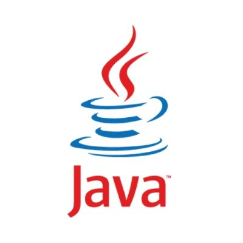

<h1>Welcome 👋 </h1> 
<h2>👨‍💻⚒Technologies, tools & interests</h2>
<section>
  
  
  
  
  <!--a href= ""></a-->
  <!--a href= ""></a-->
  <!--a href= ""></a-->
</section>
<!--h2>🔥Always Learning</h2>
<section>
  
  
  
</section-->
<!--h2>👥Other profiles</h2>
<section>
  
  
</section-->

<!--
**spiglebach/spiglebach** is a ✨ _special_ ✨ repository because its `README.md` (this file) appears on your GitHub profile.

Here are some ideas to get you started:

- 🔭 I’m currently working on ...
- 🌱 I’m currently learning ...
- 👯 I’m looking to collaborate on ...
- 🤔 I’m looking for help with ...
- 💬 Ask me about ...
- 📫 How to reach me: ...
- 😄 Pronouns: ...
- ⚡ Fun fact: ...
-->
